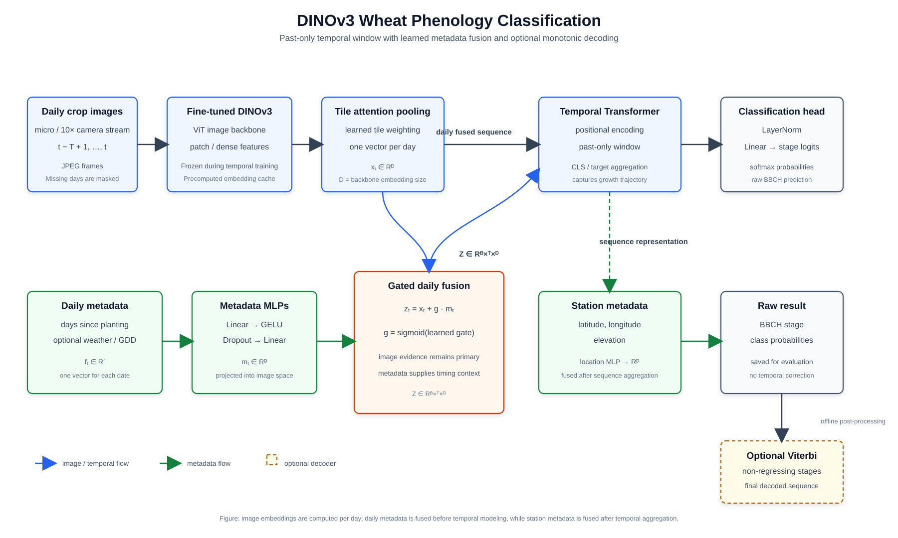

# DINOv3 BBCH Wheat Phenology

This folder is an isolated DINOv3 experiment built from the stable
`DINOv2_BBCH` pipeline. It retains the BBCH labels, causal 31-day windows,
station-level train/validation/test folds, ordinal losses, metadata fusion,
TensorBoard, resumable checkpoints, and monotonic decoding.

The image path is intentionally different: it uses compact DINOv3 dense patch
features instead of reducing every crop to one global vector.

## Architecture



For the usual `--stream micro` setup:

1. Each full-resolution 10X image is divided into overlapping crops.
2. Frozen DINOv3 encodes each crop.
3. Register tokens are excluded from the dense representation.
4. Patch tokens are adaptively pooled to a small spatial grid. The default
   stores a 2x2 patch grid plus CLS, or five descriptors per crop.
5. Learned patch attention combines those descriptors into one crop vector.
6. Learned tile attention combines all crop vectors into one daily vector.
7. The causal temporal Transformer processes the previous 31 daily vectors.
8. Optional planting-day, GDD, and location metadata are fused using the same
   tested metadata paths as `DINOv2_BBCH`.
9. The classifier predicts the ordered BBCH interval.

This is hierarchical attention: patches within crops, crops within days, then
days within the causal sequence. It preserves local spike, awn, leaf, and color
signals more directly than one global descriptor per crop.

## Requirements

DINOv3 support requires Hugging Face Transformers 4.56 or newer:

```bash
python -m pip install -r DINOv3_BBCH/requirements.txt
```

The first precompute downloads the selected pretrained backbone. Some gated
Hugging Face models may require accepting the model license and logging in.

## Metadata Check

```bash
python DINOv3_BBCH/metadata_sanity_check.py \
  --label-path labeling_bbch_iso_dates.csv \
  --data-path data \
  --camera AUTO
```

## Precompute Dense DINOv3 Features

Recommended first experiment with DINOv3 Base:

```bash
python DINOv3_BBCH/precompute_multiscale_embeddings.py \
  --label-path labeling_bbch_iso_dates.csv \
  --data-path data \
  --out-dir results_dinov3_bbch_cache \
  --image-backbone facebook/dinov3-vitb16-pretrain-lvd1689m \
  --camera AUTO \
  --stream micro \
  --tile-streams micro \
  --tile-pooling attention \
  --tile-size 224 \
  --tile-stride 112 \
  --max-tiles 0 \
  --vit-image-size 224 \
  --dense-features \
  --dense-grid-size 2 \
  --dense-include-cls \
  --embedding-dtype float16 \
  --batch-size 256 \
  --image-batch-size 16 \
  --num-workers 32 \
  --prefetch-factor 4 \
  --device cuda
```

The output cache records the backbone, preprocessing, register-token count,
patch size, dense grid, dense streams, and descriptors per tile. A DINOv2 cache
cannot be reused because the feature extractor and cache structure differ.

Precomputation decodes and tiles source images concurrently, packs tiles from
multiple images, and feeds full `--batch-size` tile chunks to the GPU. Increase
`--num-workers` until storage or CPU decoding is saturated, then increase
`--image-batch-size` enough to keep at least one full GPU tile batch ready.
`--prefetch-factor` controls how many source-image batches each worker prepares
ahead of time. The cache records these throughput settings for reproducibility;
they do not change the resulting embedding format.

`--dense-grid-size 2` stores five descriptors per crop with CLS enabled. A 4x4
grid stores 17 and uses about 3.4 times as much cache/RAM as the default. Start
with 2x2; test 4x4 only after the Base result proves that dense features help.

Use `--no-dense-features` for a controlled global-descriptor ablation. Dense
features require `--tile-pooling attention`.

## Train

This command keeps the strongest conservative settings from the previous
pipeline while isolating the DINOv3 image representation. Weather is omitted
from the first comparison so the backbone test is easier to interpret.

```bash
python DINOv3_BBCH/run_multiscale_training.py \
  --label-path labeling_bbch_iso_dates.csv \
  --data-path data \
  --out-dir results_dinov3_bbch \
  --embedding-cache results_dinov3_bbch_cache/vit_embeddings.pt \
  --epochs 30 \
  --folds 8 \
  --fold-group-by station \
  --validation-groups 2 \
  --test-groups 2 \
  --fold-seed 42 \
  --seed 42 \
  --window-days 31 \
  --window-mode causal \
  --min-train-stage-days 8 \
  --min-train-window-coverage-days 12 \
  --stream micro \
  --camera AUTO \
  --batch-size 16 \
  --accumulation-steps 2 \
  --num-workers 4 \
  --temporal-model transformer \
  --temporal-aggregation cls \
  --temporal-layers 2 \
  --temporal-heads 8 \
  --temporal-norm-first \
  --temporal-ffn-multiplier 2 \
  --loss hybrid \
  --ordinal-ce-weight 0.5 \
  --checkpoint-metric macro_f1 \
  --dropout 0.2 \
  --weight-decay 3e-4 \
  --lr 1e-4 \
  --lr-scheduler cosine \
  --warmup-ratio 0.05 \
  --use-days-since-planting \
  --temporal-feature-fusion legacy \
  --use-location-metadata \
  --location-feature-hidden-dim 16 \
  --location-gate-init 0.1 \
  --exclude-offseason \
  --monotonic-decoding none \
  --device cuda \
  --log-interval 50
```

### Leave-one-station-out evaluation

Use LOSO when every physical station must receive its own held-out test fold.
With 15 stations, this creates 15 folds containing 12 train, 2 validation, and
1 test station. Every station is tested exactly once and appears in validation
exactly twice. `--fold-seed` changes the balanced validation rotation and fold
order; it does not change which stations are eventually tested.

```bash
python DINOv3_BBCH/run_multiscale_training.py \
  --label-path labeling_truncated2.csv \
  --data-path data \
  --out-dir results_dinov3_bbch_loso \
  --embedding-cache results_dinov3_bbch/vit_embeddings.pt \
  --fold-strategy loso \
  --fold-group-by station \
  --expected-stations 15 \
  --validation-groups 2 \
  --test-groups 1 \
  --fold-seed 42 \
  --epochs 20 \
  --window-days 21 \
  --window-mode causal \
  --date-tolerance-days 5 \
  --min-train-stage-days 8 \
  --min-train-window-coverage-days 12 \
  --stream micro \
  --batch-size 32 \
  --temporal-model transformer \
  --temporal-aggregation cls \
  --temporal-layers 2 \
  --temporal-heads 8 \
  --loss hybrid \
  --ordinal-ce-weight 0.5 \
  --checkpoint-metric macro_f1 \
  --dropout 0.2 \
  --weight-decay 3e-4 \
  --use-days-since-planting \
  --temporal-feature-fusion gated \
  --use-location-metadata \
  --exclude-offseason \
  --device cuda
```

LOSO uses all station codes present in the generated metadata, regardless of
the value of `--folds`. Check `fold_assignments.csv` before training to confirm
that the label table and image discovery exposed all expected stations.

## Partial DINOv3 Fine-Tuning

The cached workflow normally freezes DINOv3. Fine-tuning is now available as a
fold-specific three-stage pipeline. It fine-tunes the final image-backbone
blocks using tiled single-day images, rebuilds dense embeddings with that
backbone, and then trains the temporal model on the matching fold.

Fine-tune one LOSO fold:

```bash
python DINOv3_BBCH/finetune_dinov3_backbone.py \
  --label-path labeling_bbch_iso_dates.csv \
  --data-path data \
  --out-dir results_dinov3_backbone_finetune \
  --fold-id 1 \
  --fold-seed 42 \
  --validation-groups 2 \
  --expected-stations 15 \
  --stream micro \
  --camera AUTO \
  --epochs 8 \
  --batch-size 1 \
  --accumulation-steps 8 \
  --unfreeze-last-blocks 1 \
  --backbone-lr 2e-6 \
  --head-lr 1e-4 \
  --weight-decay 1e-2 \
  --tile-size 224 \
  --tile-stride 224 \
  --max-tiles 16 \
  --dense-grid-size 2 \
  --exclude-offseason \
  --device cuda
```

### All-station master run

To fine-tune, cache, and temporally train every discovered LOSO station while
retaining every fold's backbone and embedding cache, use the master runner:

```bash
python DINOv3_BBCH/run_finetuned_loso_pipeline.py \
  --label-path labeling_truncated2.csv \
  --cache-label-path labeling_bbch_iso_dates.csv \
  --data-path data \
  --out-root results_dinov3_finetuned_loso \
  --image-backbone facebook/dinov3-vitb16-pretrain-lvd1689m \
  --expected-stations 13 \
  --fold-seed 42 \
  --seed 42 \
  --stream micro \
  --camera AUTO \
  --tile-size 224 \
  --vit-image-size 224 \
  --cache-tile-stride 112 \
  --cache-max-tiles 0 \
  --dense-grid-size 2 \
  --embedding-dtype float16 \
  --cache-batch-size 256 \
  --cache-num-workers 8 \
  --temporal-epochs 30 \
  --temporal-batch-size 32 \
  --temporal-accumulation-steps 1 \
  --temporal-num-workers 2 \
  --window-days 21 \
  --date-tolerance-days 5 \
  --min-train-stage-days 8 \
  --min-train-window-coverage-days 12 \
  --temporal-layers 2 \
  --temporal-heads 8 \
  --temporal-ffn-multiplier 2 \
  --ordinal-ce-weight 0.5 \
  --checkpoint-metric macro_f1 \
  --temporal-dropout 0.2 \
  --temporal-weight-decay 3e-4 \
  --temporal-lr 1e-4 \
  --warmup-ratio 0.05 \
  --temporal-feature-hidden-dim 32 \
  --temporal-feature-gate-init 0.1 \
  --location-feature-hidden-dim 16 \
  --location-gate-init 0.1 \
  --monotonic-decoding none \
  --device cuda
```

This configuration reproduces the cache and temporal settings of the previous
two-command experiment. `labeling_truncated2.csv` defines its 13 LOSO stations;
the full BBCH table is used only to cache a superset of images. LOSO ignores
`--folds 15` and automatically creates one fold per discovered split station.
The master additionally fine-tunes one DINOv3 block per fold before cache
creation, so precompute uses that fold's local backbone rather than the
original Facebook checkpoint. Outputs are retained under:

```text
results_dinov3_finetuned_loso/
  backbones/fold_N/backbone/
  embedding_caches/fold_N/vit_embeddings.pt
  temporal/fold_N/
  aggregate_loso/
```

Completed stages are detected from their final artifacts and skipped on a
rerun. Interrupted temporal stages automatically resume from their
`last_checkpoint.pt`. Useful controls include:

```text
--start-fold 4 --end-fold 8
--stages finetune precompute
--stages train aggregate
--force-stage precompute
--dry-run
--continue-on-error
```

The master script preserves all caches; it does not delete completed folds.
`aggregate_loso/summary.json` contains image-weighted and station-balanced
results after the selected temporal folds finish.

The selected Hugging Face backbone is saved to
`results_dinov3_backbone_finetune/fold_1/backbone`. Rebuild that fold's dense
cache using the local directory as the model identifier:

```bash
python DINOv3_BBCH/precompute_multiscale_embeddings.py \
  --label-path labeling_bbch_iso_dates.csv \
  --data-path data \
  --out-dir results_dinov3_finetuned_cache/fold_1 \
  --image-backbone results_dinov3_backbone_finetune/fold_1/backbone \
  --camera AUTO \
  --stream micro \
  --tile-streams micro \
  --tile-pooling attention \
  --tile-size 224 \
  --tile-stride 112 \
  --dense-features \
  --dense-grid-size 2 \
  --embedding-dtype float16 \
  --batch-size 256 \
  --num-workers 8 \
  --device cuda
```

Train only the corresponding original temporal fold:

```bash
python DINOv3_BBCH/run_multiscale_training.py \
  --label-path labeling_bbch_iso_dates.csv \
  --data-path data \
  --out-dir results_dinov3_finetuned_temporal/fold_1 \
  --embedding-cache results_dinov3_finetuned_cache/fold_1/vit_embeddings.pt \
  --fold-strategy loso \
  --fold-group-by station \
  --only-fold 1 \
  --expected-stations 15 \
  --validation-groups 2 \
  --test-groups 1 \
  --fold-seed 42 \
  --epochs 20 \
  --window-days 21 \
  --window-mode causal \
  --date-tolerance-days 5 \
  --min-train-stage-days 8 \
  --min-train-window-coverage-days 12 \
  --stream micro \
  --batch-size 32 \
  --temporal-model transformer \
  --temporal-aggregation cls \
  --temporal-layers 2 \
  --temporal-heads 8 \
  --loss hybrid \
  --ordinal-ce-weight 0.5 \
  --checkpoint-metric macro_f1 \
  --dropout 0.2 \
  --weight-decay 3e-4 \
  --use-days-since-planting \
  --temporal-feature-fusion gated \
  --use-location-metadata \
  --exclude-offseason \
  --device cuda
```

Repeat all three stages with the same fold number for every LOSO fold. Never
reuse a backbone or cache fine-tuned for one fold in another fold: that would
expose the later test station to backbone training and invalidate LOSO. Start
with one fold as an A/B test against the frozen backbone before committing to
all 15 expensive fine-tuning runs.

Process folds sequentially rather than retaining 15 dense caches. After a
fold's temporal training and exported metrics are complete, its embedding
cache can be removed and regenerated later from the much smaller saved
`backbone` directory. Treat the image-level test metric as a diagnostic only;
choose fine-tuning hyperparameters from validation results so repeated A/B
experiments do not indirectly tune against held-out stations.

### Automated LOSO runner

The complete three-stage loop is available as:

```bash
bash DINOv3_BBCH/run_finetuned_loso.sh
```

The runner performs an authenticated Hugging Face access check before fold 1.
For the gated Meta checkpoint, first accept the conditions on the
`facebook/dinov3-vitb16-pretrain-lvd1689m` model page. Then verify that the same
Linux account running the script can see its token:

```bash
hf auth whoami
python3 -c "from huggingface_hub import get_token, whoami; t=get_token(); print('token visible:', bool(t)); print(whoami(token=t)['name'] if t else 'none')"
env | grep -E '^HF_(TOKEN|HOME|TOKEN_PATH|HUB_OFFLINE|HUB_DISABLE_IMPLICIT_TOKEN)=' || true
```

A stale `HF_TOKEN` environment variable takes priority over the saved login.
Unset it and log in again, or deliberately export the active token. A local
download avoids network authentication during the long run:

```bash
hf download facebook/dinov3-vitb16-pretrain-lvd1689m \
  --local-dir models/dinov3-vitb16

IMAGE_BACKBONE=models/dinov3-vitb16 \
  bash DINOv3_BBCH/run_finetuned_loso.sh
```

It defaults to `labeling_truncated3.csv`, folds 1 through 15, and removes each
large dense cache only after that fold produces final temporal test metrics.
Fine-tuned backbones, temporal checkpoints, predictions, and metrics remain.
The runner skips completed stages and resumes an interrupted temporal stage.

Useful environment overrides:

```bash
# Smoke-test one fold and retain its cache for inspection.
FOLD_START=1 FOLD_END=1 KEEP_CACHES=1 \
  bash DINOv3_BBCH/run_finetuned_loso.sh

# Continue folds 6 through 15 with a different result root.
FOLD_START=6 FOLD_END=15 RESULT_ROOT=results_dinov3_finetuned_loso_v2 \
  bash DINOv3_BBCH/run_finetuned_loso.sh
```

After the requested range completes, combined CSVs, confusion counts, and a
JSON summary are written under
`results_dinov3_finetuned_loso/temporal/aggregate`.

Dense cache tensors consume more host RAM and batch-transfer bandwidth than the
old tile cache. `batch-size 16` with accumulation 2 preserves an effective batch
of 32. Increase the physical batch only after checking GPU memory and step time.

## DINOv3 Large A/B Test

Change only the precompute backbone and output directories:

```text
--image-backbone facebook/dinov3-vitl16-pretrain-lvd1689m
```

Large produces 1024-dimensional descriptors instead of Base's 768-dimensional
descriptors, so it needs a separate cache and more disk, RAM, and extraction
time. Keep folds, seeds, dense grid, tiling, labels, metadata, and training
hyperparameters identical for a valid comparison.

## Cached Window Inference

```bash
python DINOv3_BBCH/infer_cached_window.py \
  --checkpoint results_dinov3_bbch/fold_1/best_model.pt \
  --embedding-cache results_dinov3_bbch_cache/vit_embeddings.pt \
  --image-path data/02.02/2015/K1/10X/example.jpeg \
  --image-dir data/02.02/2015/K1/10X \
  --planting-date 2014-10-20 \
  --station-code 02.02 \
  --debug-window \
  --device cuda
```

Inference reconstructs the same dense descriptors and rejects a checkpoint/cache
pair whose dense settings differ.

## Desktop Demo UI

For an interactive demo instead of the console scripts, launch the project-level
Tkinter application:

```powershell
.\.venv\Scripts\python.exe demo\demo_ui.py
```

The UI previews an individually selected target image, lets the user choose the
folder containing earlier temporal images, temporal checkpoint weights, and the
compatible ViT pipeline. DINOv3 is selected by default. The single **Backbone
source** selector is mutually exclusive: choose a default model ID, a custom
`.pt`/`.pth` fine-tuned checkpoint, or a local Hugging Face `save_pretrained`
directory. For DINOv3 fine-tuning checkpoints produced by this project, the
architecture is reconstructed from the tensor shapes and checkpoint metadata, so
custom-weight inference does not contact Hugging Face. An embedding cache is
optional but recommended because it preserves the training-time backbone,
preprocessing, and tiling configuration. Target date, planting date, station,
and CPU/CUDA selection are also available when required by a checkpoint.

The temporal folder is optional. When omitted, only the selected target image is
encoded and all earlier causal-window positions are masked. This is convenient
for a diagnostic single-image prediction; selecting a dated image folder remains
the realistic temporal deployment mode.

## Outputs

Each fold contains its best model, resumable last checkpoint, split information,
validation/test predictions, metrics, and confusion matrix. Combined outputs and
TensorBoard logs are written under the run output directory.

The primary comparison should use held-out station macro F1, exact accuracy,
plus/minus-one accuracy, and per-stage recall. Select checkpoints using validation
metrics only; inspect the test split after checkpoint selection.
